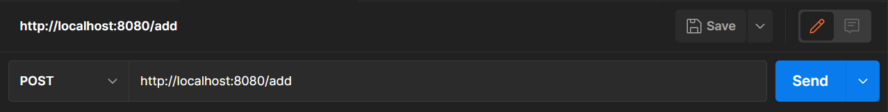
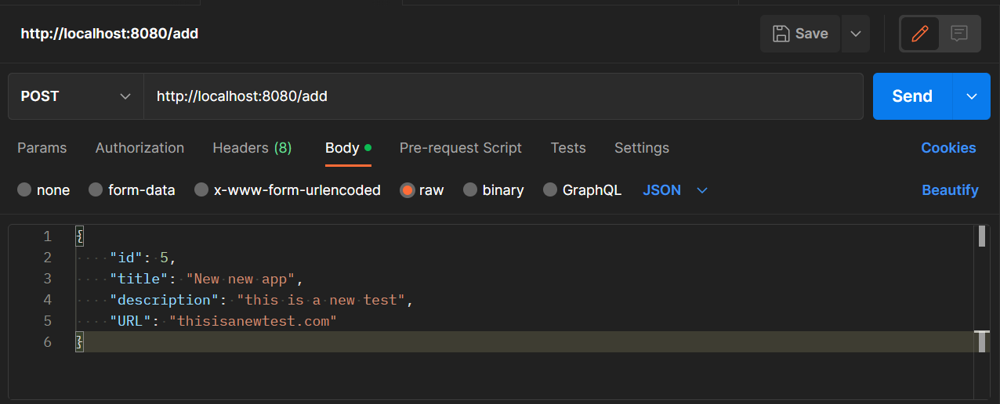
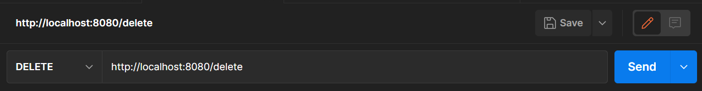
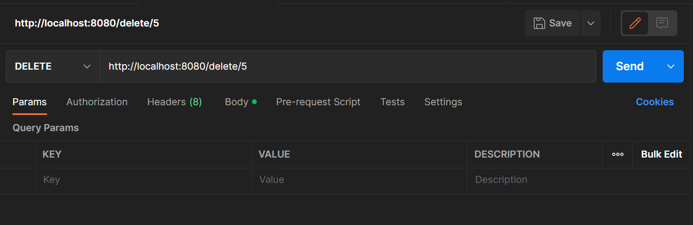
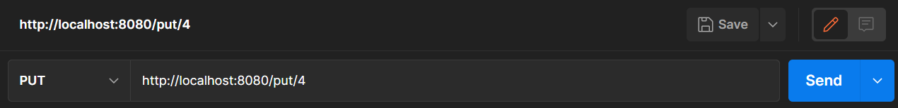
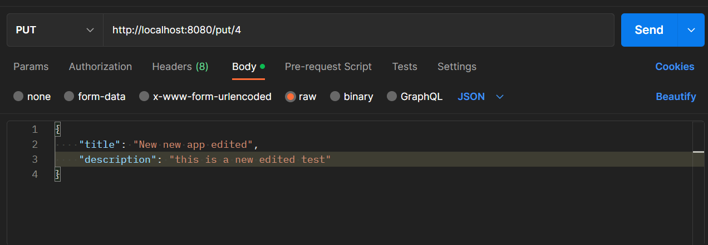

# Web Projects API

## This document will show you how to use postman to make api requests

### Make a POST request
- Select the POST option in postman
- enter the following link 'http://localhost:8080/add' into the URL bar

- Select the 'Body' tab, and set the language to JSON
- Enter the details of your new project as shown below

- Press the Send button and your project will be added

### Make a DELETE request
- Select the DELETE option in postman
- enter the following link 'http://localhost:8080/delete' into the URL bar

- Enter the id number of the project you wish to delete within the URL

- Press the Send button and your project will be deleted

### Make a PUT request
- Select the PUT option in postman
- enter the following link 'http://localhost:8080/put' into the URL bar
- Enter the id number of the project you wish to edit within the URL

- Select the 'Body' tab, and set the language to JSON
- Enter the details you would like to update as shown below

- Press the Send button and your project will be update